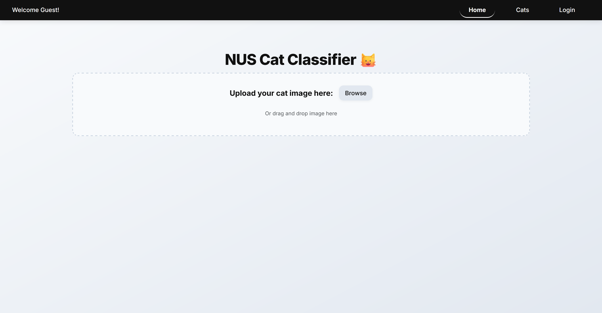
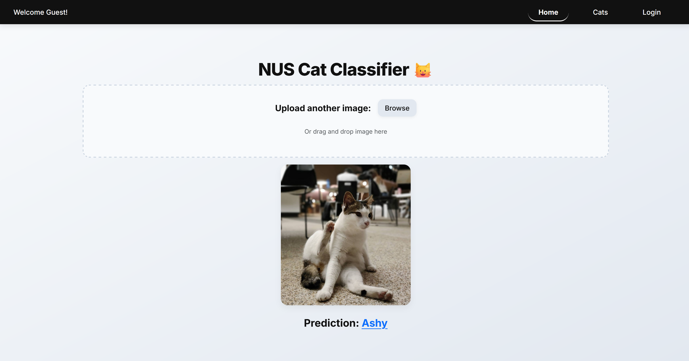
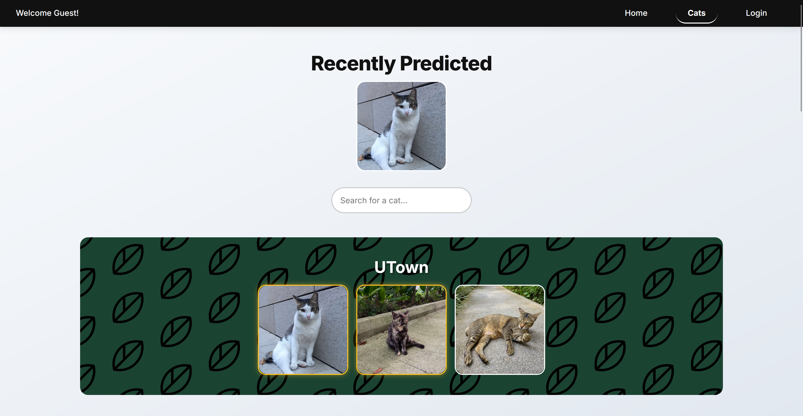
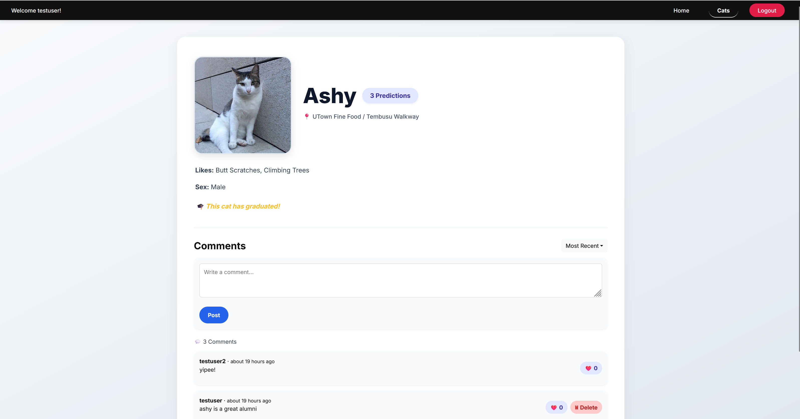
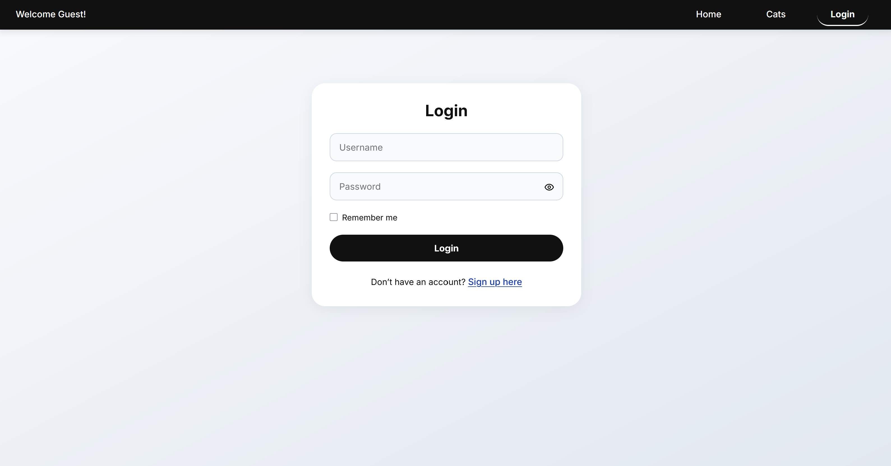
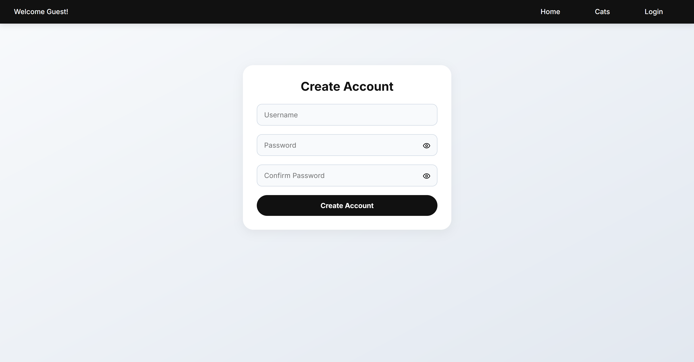

# NUS Cat Classifier

Welcome to **NUS Cat Classifier**, a full-stack web application designed to identify and classify the iconic campus cats of the National University of Singapore (NUS). Users can upload images, receive instant predictions, and explore detailed profiles of these beloved felines.

  <a href="https://nus-cat-classifier.onrender.com">Live Demo</a> •

  
  
  

  Note: As this app runs on Render's free tier, the initial load and image prediction may take up to a minute.

---

## Tech Stack

- **Frontend:** React, React Router, React Bootstrap
- **Backend:** Flask, MongoDB Atlas
- **Machine Learning:** PyTorch
- **Deployment:** Render (frontend and backend)

---

## Machine Learning Pipeline

This application uses a **two-stage model architecture** to provide accurate image classification:

### 1. Cat Detection Model
A convolutional neural network (CNN) trained to determine whether the uploaded image contains a cat or not. This acts as a filter to prevent invalid or unrelated submissions from proceeding.

### 2. Cat Identification Model
If the image is deemed to contain a cat, it is passed through a second CNN which identifies **which NUS cat** it resembles most closely. This multi-class classifier is trained on labelled images of various known NUS cats.

> Model training was inspired by Andrew Ng’s “Introduction to Neural Networks” on <a href="https://www.coursera.org/learn/neural-networks-deep-learning">Coursera</a>. 
> Cat images used in classification were collected from and attributed to <a href="https://www.instagram.com/nuscatcafe/">NUScatcafe</a>.

---

## Website Structure and Features

### Home Page (`/`)

- Simple and modern interface for image upload
- Live preview of selected image
- 'Predict' button triggers backend inference
- Responsive loading indicator
- Classification results shown clearly below the image

### Cats Page (`/cats`)

- View a comprehensive list of all NUS cats
- Grouped by **location**, e.g.:
  - UTown
  - Engineering
  - Arts
  - Science
- Use the **search bar** to filter by name
- Most recently predicted cat will be displayed at the top

### Cat Detail Page (`/cats/:slug`)

- Deep dive into each cat’s background
- Information shown includes:
  - Full name
  - Specific location
  - Likes and dislikes
  - Community comments
  - Prediction statistics
- Allows users to contribute **comments** with timestamps
- Like/unlike and delete options for logged-in users

### Login / Signup Page (`/login`, `/signup`)

- Secure authentication flow with token-based login
- Signup form includes:
  - Password strength indicator
  - Password visibility toggle
  - Real-time username availability check
- Comments and likes are restricted to logged-in users
- Automatic redirect to home after successful login

---

## About

This project was created with love for NUS and its iconic cats.

---

## Licence
See [LICENSE](LICENSE).
